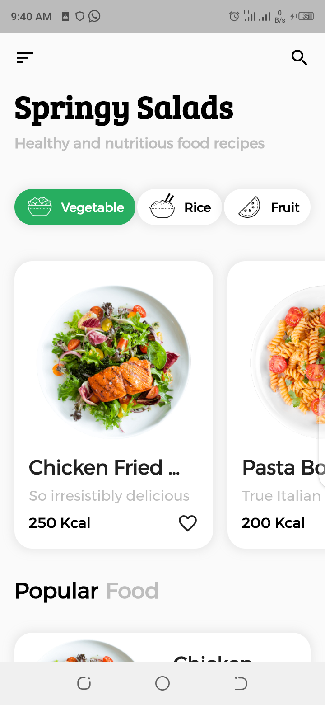
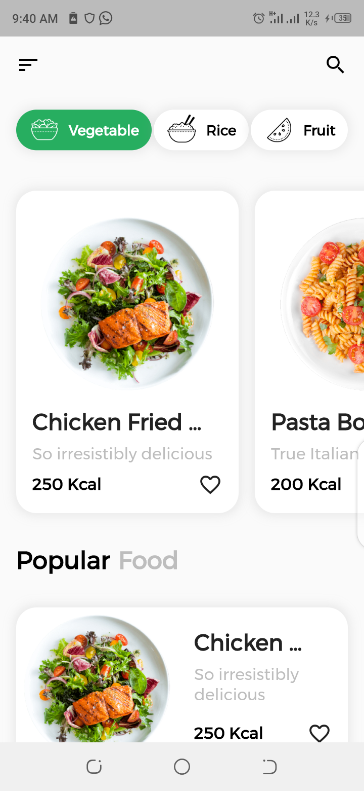
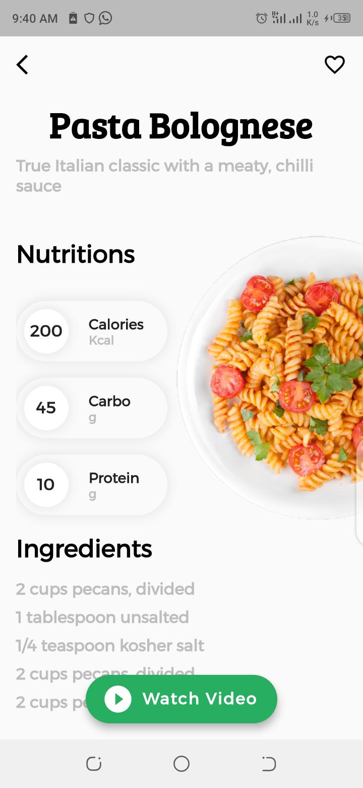
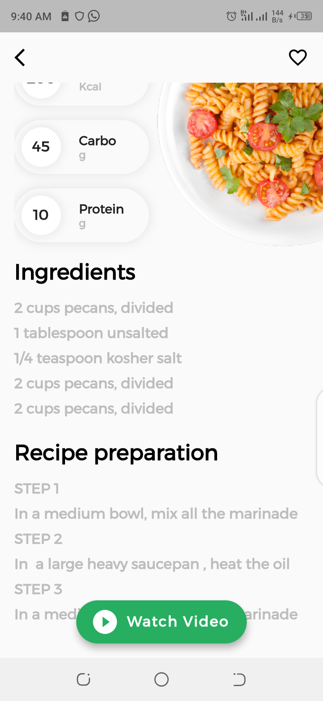

<h1>Recipe Application</h1>

This is a mobile application made with flutter. The applicaiton provides recipes based on the pre input files in the system. The application uses an offline data stored in the system

<h4>List page Screenshot1</h4> 
  
<h4>List page Screenshot2</h4> 
  
<h4>Detail page Screenshot1</h4> 
  
<h4>Detail page Screenshot2</h4> 
 
<h4></h4>